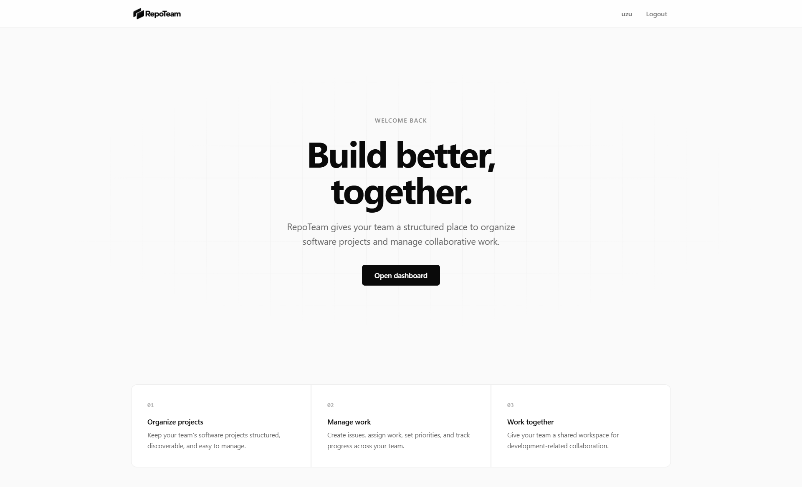
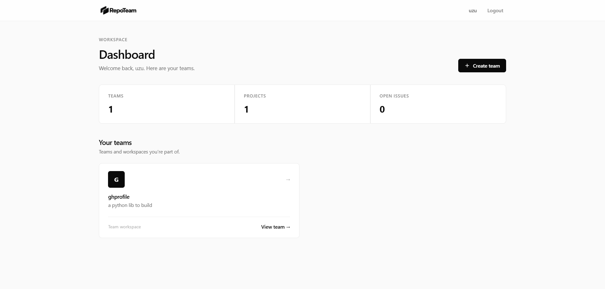
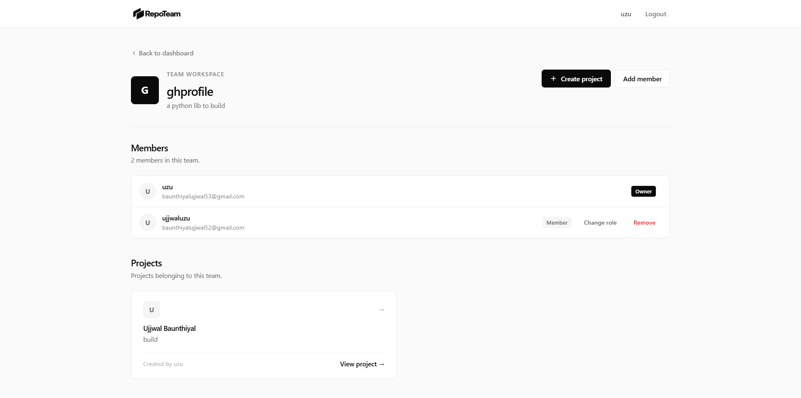
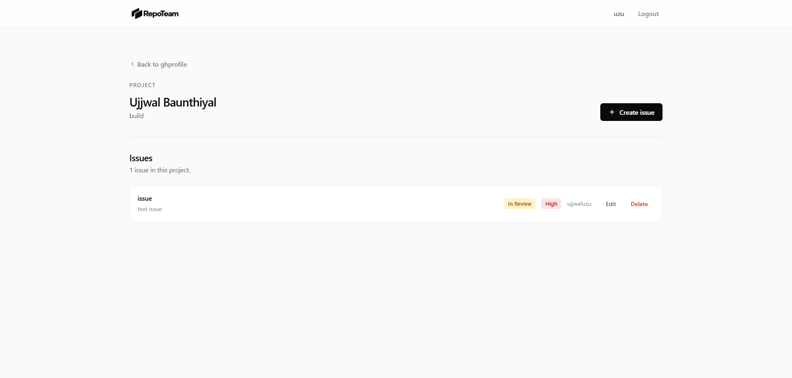

# RepoTeam

RepoTeam is a collaborative software project management platform built with Django. It gives development teams a central place to create teams, organize software projects, track issues, assign work, and collaborate on development-related work.

## Project Status

> **MVP — Minimal Viable Product.** RepoTeam is currently an MVP designed to validate the core team-project-issue workflow. It is **not yet production-ready** and is under active development.

The current scope of the MVP focuses on:

- User accounts (registration, login, logout)
- Team creation and member management with role-based access control
- Project organization inside teams
- Issue tracking with statuses, priorities, and assignment

Anything beyond that — comment UIs, notifications, analytics, search, and so on — is listed under [Future Improvements](#future-improvements) and is **not part of the current codebase**.

## Features

The following features are implemented in the current MVP:

### Accounts & Authentication

- User registration with username, email, and password confirmation
- Login and logout (logout is CSRF-protected via a POST form)
- Personalized welcome screen for authenticated users

### Dashboard

- Personal workspace summary showing the user's teams
- Live counters for **Teams**, **Projects**, and **Open issues** across the user's teams
- Quick "Create team" action and team list with open/empty states

### Teams

- Create teams with a name and description
- Team workspace page with member list and project list
- Invite members by **username**
- Remove members
- Change member roles (Owner, Admin, Member)
- Owner/admin-only management actions; members have read-only team access

### Projects

- Create projects inside a team
- Project workspace page listing all issues
- Creator metadata shown on each project

### Issues

- Create issues with a title, description, status, priority, and assignee
- Edit existing issues
- Delete issues with a confirmation step
- Assign issues to any team member
- Issue statuses:
  - ✅ To Do
  - 🔄 In Progress
  - 👀 In Review
  - ✅ Done
- Issue priorities:
  - Low
  - Medium
  - High

### Permissions

- Permission checks on every authenticated page, including inviting, removing, and role changes for members, admins, and owners

> **Note:** A `Comment` model exists in the data layer, but commenting is **not yet implemented** in the UI. No screens, forms, or routes expose it in the current MVP.

## Screenshots

### Homepage



### Dashboard



### Team Detail



### Project Detail



## Tech Stack

| Layer    | Technology                                         |
| -------- | -------------------------------------------------- |
| Backend  | [Python](https://www.python.org/) (Django 5.2)     |
| Framework| [Django](https://www.djangoproject.com/) 5.2       |
| Database | [SQLite](https://www.sqlite.org/)                  |
| Templates| Django Template Language (HTML)                     |
| Styling  | Custom CSS (CSS variables, design-system based)     |
| Scripting| Minimal vanilla JavaScript                          |

The interface uses Django server-rendered templates with a custom CSS design system. No frontend frameworks are used.

## Project Structure

```text
RepoTeam/
├── manage.py                     # Django management entry point
├── db.sqlite3                    # Local SQLite database
├── logo.png                      # Brand logo (also copied into static)
├── favicon.png                   # Site favicon (also copied into static)
├── repoteam/                     # Django project configuration
│   ├── settings.py               # Project settings
│   ├── urls.py                   # Root URL configuration
│   ├── asgi.py                   # ASGI entry point
│   └── wsgi.py                   # WSGI entry point
├── core/                         # Main application
│   ├── models.py                 # Team, Membership, Project, Issue, Comment
│   ├── views.py                  # All page views and logic
│   ├── forms.py                  # Registration, Team, Project, Issue, Invite forms
│   ├── urls.py                   # Application URL routes
│   ├── admin.py                  # Django admin registrations
│   ├── tests.py                  # Automated test suite
│   ├── templates/core/           # HTML templates
│   └── static/core/              # CSS and image assets
└── README.md
```

## Installation and Setup

### Prerequisites

- Python 3.10 or newer
- pip

### 1. Clone the repository

```bash
git clone https://github.com/ujjwaluzu/RepoTeam.git
cd RepoTeam
```

### 2. Create a virtual environment

```bash
python -m venv venv
```

### 3. Activate the virtual environment

**Windows:**

```bash
venv\Scripts\activate
```

**macOS/Linux:**

```bash
source venv/bin/activate
```

### 4. Install dependencies

> The project does **not** currently include a `requirements.txt`. Install Django directly:

```bash
pip install django
```

Compatibility is verified against **Django 5.2**.

### 5. Run database migrations

```bash
python manage.py migrate
```

### 6. Create a superuser (optional, for Django admin)

```bash
python manage.py createsuperuser
```

The Django admin is available at <http://127.0.0.1:8000/admin/> and registers `Team`, `Membership`, `Project`, `Issue`, and `Comment`.

### 7. Start the development server

```bash
python manage.py runserver
```

### 8. Open the application

Visit <http://127.0.0.1:8000/> in your browser.

## Usage

A typical user flow:

1. **Register** an account at `/register/`
2. **Log in** at `/login/`
3. **Create a team** from the dashboard
4. **Invite team members** by username from the team workspace
5. **Create a project** inside the team
6. **Create and assign issues** within the project
7. **Update issue statuses and priorities** (or edit issues) over the life of the work
8. **Manage team members and roles** (owner-only for role changes)
9. **Track project work** from the dashboard and workspace pages

## User Roles and Permissions

Based on the permission checks implemented in `core/views.py`:

### Owner

- Full team access
- Invite members ✅
- Remove members (including admins) ✅
- Change member roles ✅
- Create projects ✅
- Create, edit, and delete issues ✅
- The owner's own membership **cannot** be removed or re-assigned

### Admin

- Full team access
- Invite members ✅
- Remove members ✅, but **cannot** remove an owner or another admin (only the owner can remove an admin)
- Change member roles ❌ (owner only)
- Create projects ✅
- Create, edit, and delete issues ✅

### Member

- Read access to team workspace
- Create projects ✅
- Create, edit, and delete issues ✅
- Invite members ❌
- Remove members ❌
- Change member roles ❌

All permission checks redirect unauthorized users back to the team page with a message, and non-members are redirected to the dashboard.

## Data Models

| Model      | Purpose                                                       | Key relationships                                                      |
| ---------- | -------------------------------------------------------------- | ---------------------------------------------------------------------- |
| `User`     | Django's built-in authentication user                          | Reference for created-by, assigned-to, and memberships                  |
| `Team`     | A workspace for a group of people                              | `created_by` → `User`; many `Membership` and `Project` records          |
| `Membership`| Links a user to a team with a role                             | `user` → `User`, `team` → `Team`, role choices: Owner / Admin / Member  |
| `Project`  | A software project inside a team                               | `team` → `Team`, `created_by` → `User`; many `Issue` records            |
| `Issue`    | A piece of work tracked in a project                           | `project` → `Project`, `created_by` → `User`, `assigned_to` → `User`    |
| `Comment`  | A model for issue comments (model only — no UI yet)            | `issue` → `Issue`, `author` → `User`                                    |

### Relationships summary

- A **Team** has many **Memberships** (many users) and many **Projects**.
- A **Project** belongs to one **Team** and is created by one **User**.
- An **Issue** belongs to one **Project**, is created by one **User**, and may be assigned to one **User** (`assigned_to`, nullable — issues can be unassigned).
- A **Comment** belongs to one **Issue** and is written by one **User**.

## Issue Management

The issue workflow in the current MVP:

1. **Create** an issue from the project page, providing title, description, status, priority, and an optional assignee (team members only).
2. **Assign** an issue at creation or when editing; the assignee selector is limited to team members.
3. **Set priority** at creation or when editing (Low / Medium / High).
4. **Update status** at creation or when editing (To Do / In Progress / In Review / Done).
5. **Edit** any issue to change fields at any time.
6. **Delete** an issue through a confirmation page (destructive action, not reversible).
7. **Comments** are not yet available in the UI.

## Development

During development, the following commands are useful:

| Command                                    | Purpose                              |
| ------------------------------------------ | ------------------------------------ |
| `python manage.py check`                   | Verify system configuration           |
| `python manage.py makemigrations`          | Create migrations from model changes  |
| `python manage.py migrate`                 | Apply database migrations             |
| `python manage.py runserver`               | Start the development server          |
| `python manage.py test`                    | Run the automated test suite          |

The test suite covers page rendering, issue CRUD flows, team/project/issue creation, and role-based permission checks.

## Future Improvements

These ideas go **beyond the current MVP** and are listed as planned or potential improvements only. None of these exist in the codebase today:

- Real-time notifications
- Activity feeds
- Advanced issue filtering and search
- File attachments on issues and projects
- GitHub integration (e.g., issues ↔ GitHub issues)
- Email invitations instead of username-based invites
- Kanban board view for issues
- Project analytics and reporting
- Dark mode
- Issue comments UI (the data model already exists)
- Production deployment configuration (e.g., gunicorn, environment variables, PostgreSQL)

## Contributing

Contributions are welcome. To contribute:

1. Fork the repository.
2. Create a feature branch (`git checkout -b feature/your-feature`).
3. Make your changes and commit them with a clear message.
4. Push to your fork and open a pull request.

Please make sure the test suite passes before submitting:

```bash
python manage.py test
```

## License

A license has not yet been selected for this project.

## Author

- **Project:** RepoTeam
- **GitHub repository:** <https://github.com/ujjwaluzu/RepoTeam>